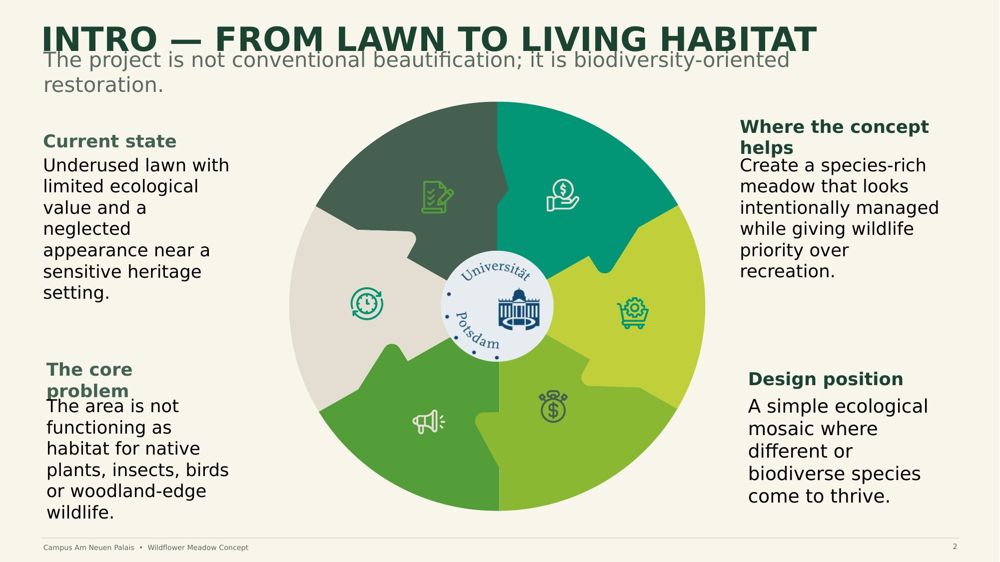

# 01 — Concept Overview

**From lawn to living habitat.** This project is not conventional beautification; it is biodiversity-oriented restoration.

**Current state**
An underused lawn with limited ecological value and a neglected appearance, sitting near a sensitive heritage setting on Campus Am Neuen Palais.

**The core problem**
The area is not functioning as habitat for native plants, insects, birds, or woodland-edge wildlife.

**Where the concept helps**
Create a species-rich meadow that looks intentionally managed while giving wildlife priority over recreation.

**Design position**
A simple ecological mosaic where different, biodiverse species come to thrive.

