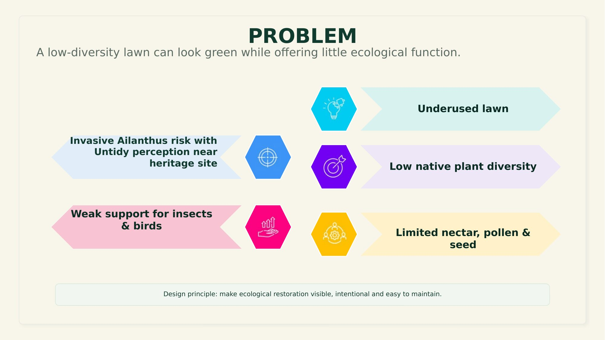

# 02 — Problem Analysis

A low-diversity lawn can look green while offering little ecological function.

- Underused lawn
- Invasive *Ailanthus* risk, with an untidy perception near the heritage site
- Low native plant diversity
- Weak support for insects & birds
- Limited nectar, pollen & seed availability

**Design principle:** make ecological restoration visible, intentional, and easy to maintain.

