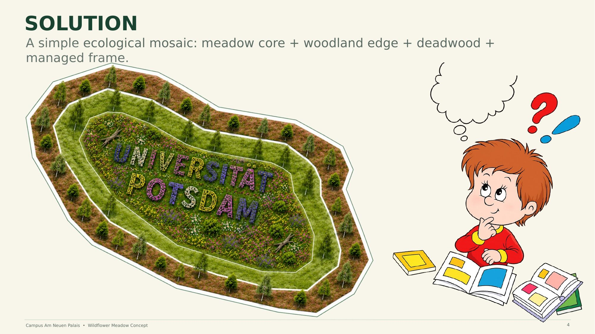

# 03 — Solution Design

A simple ecological mosaic: **meadow core + woodland edge + deadwood + managed frame.**

Each zone plays a distinct ecological role — the meadow core maximizes flowering diversity for pollinators, the woodland edge provides transitional habitat, retained deadwood supports insects and fungi, and the managed frame keeps the intervention legible and acceptable within the heritage-protected campus setting.

