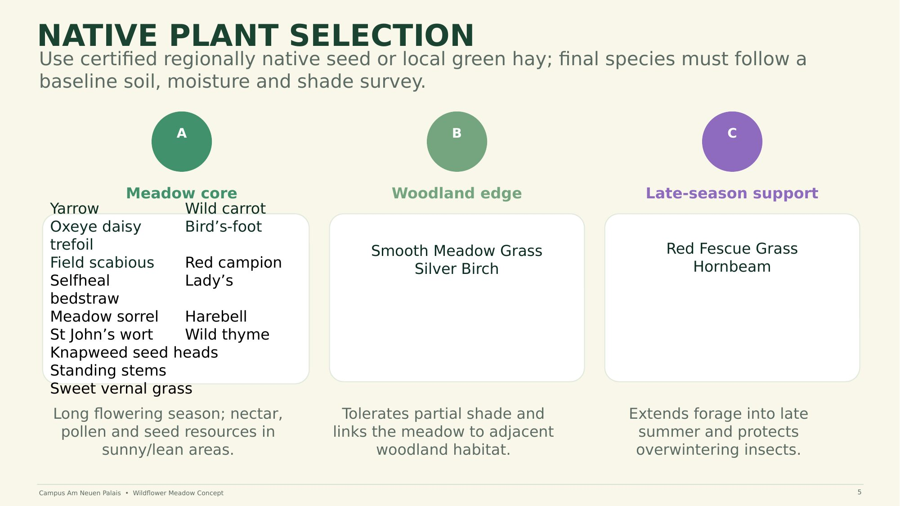

# 04 — Native Plant Selection

Use certified regionally native seed or local green hay. Final species selection must follow a baseline soil, moisture, and shade survey — plant choices are not fixed up front, they are derived from site conditions.

This approach is deliberately evidence-based: rather than specifying species in the abstract, the concept ties selection to measured site data (soil composition, moisture regime, shade cover) so the meadow is suited to actual conditions on Campus Am Neuen Palais and resilient to Brandenburg's increasingly hot, dry summers.

