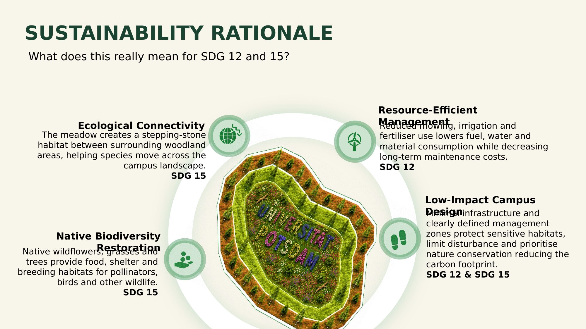

# 05 — Sustainability Rationale

**What does this really mean for SDG 12 and SDG 15?**

**SDG 12 — Responsible Consumption & Production**
Use upcycled, regional, or resource-efficient materials. Minimize waste. Favour circular approaches — reflected in the choice of local green hay/certified regional seed over imported or synthetic alternatives, and in retaining deadwood on-site rather than removing it as waste.

**SDG 15 — Life on Land**
Support native flora & fauna, improve the microclimate, unseal surfaces, and create ecological corridors on campus — reflected in the native species selection, the multi-year invasive species control plan, and the uncut refuge zones built into the maintenance model.

