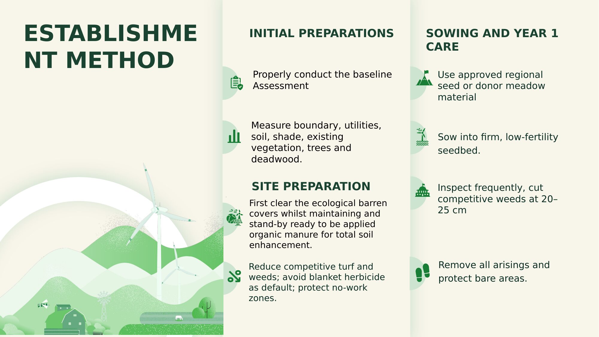

# 06 — Implementation Plan

**Initial preparations**
Properly conduct the baseline assessment: measure boundary, utilities, soil, shade, existing vegetation, trees, and deadwood.

**Site preparation**
First clear the ecologically barren cover while maintaining readiness to apply organic manure for total soil enhancement. Reduce competitive turf and weeds; avoid blanket herbicide as a default; protect no-work zones.

**Establishment method**
Sow into a firm, low-fertility seedbed.

**Sowing and Year 1 care**
Inspect frequently; cut competitive weeds at 20–25 cm.

