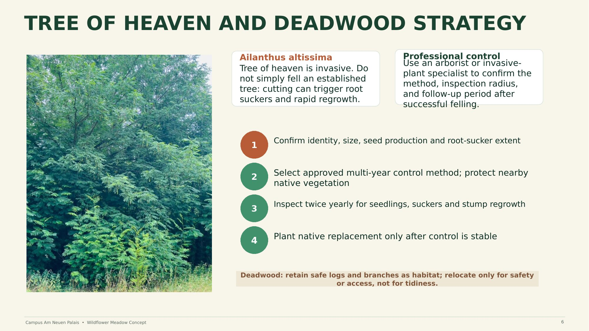

# 07 — Invasive Species & Deadwood Strategy

## Tree of Heaven (*Ailanthus altissima*)

The site hosts an invasive *Ailanthus altissima*, which the Green Office wants removed — but tree of heaven is invasive and aggressive: **do not simply fell an established tree**, since cutting can trigger root suckers and rapid regrowth.

Control sequence:

1. Confirm identity, size, seed production, and root-sucker extent.
2. Select an approved multi-year control method; protect nearby native vegetation.
3. Inspect twice yearly for seedlings, suckers, and stump regrowth.
4. Plant a native replacement only after control is confirmed stable.

## Deadwood

Retain safe logs and branches as habitat. Relocate only for safety or access reasons — never for tidiness alone.

