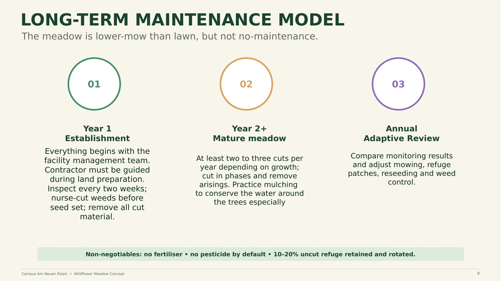

# 08 — Long-Term Maintenance Model

The meadow is lower-mow than a lawn, but **not** no-maintenance.

**01 — Year 1: Establishment**
Everything begins with the facility management team; the contractor must be guided during land preparation. Inspect every two weeks; nurse-cut weeds before seed set; remove all cut material.

**02 — Year 2+: Mature meadow**
At least two to three cuts per year depending on growth; cut in phases and remove arisings. Practice mulching to conserve water around the trees especially.

**03 — Annual: Adaptive review**
Compare monitoring results and adjust mowing, refuge patches, reseeding, and weed control.

**Non-negotiables:** no fertiliser · no pesticide by default · 10–20% uncut refuge retained and rotated.

