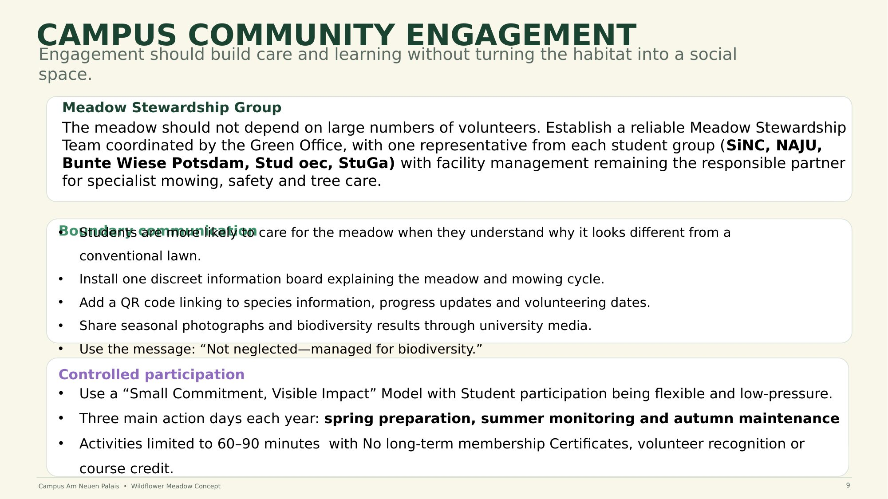

# 09 — Community Engagement

Engagement is designed to build care and learning **without** turning the habitat into a general-purpose social space — the meadow's function is ecological first.

The approach centers on giving students and staff visible, low-effort ways to participate in and learn from the meadow's establishment and upkeep, building a sense of shared ownership over the space rather than treating it as something facilities alone maintains.

