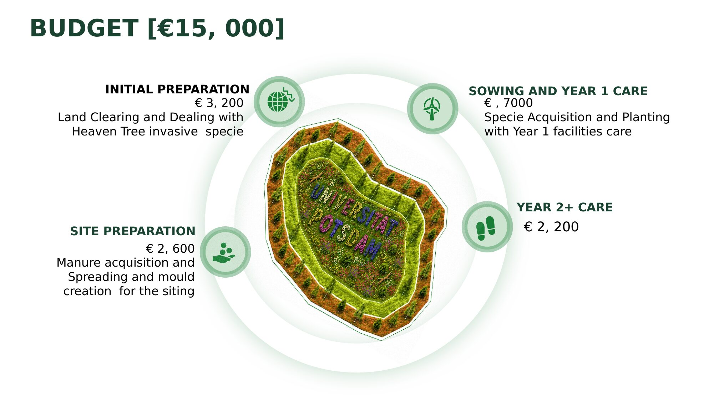

# 10 — Budget

**Total: €15,000** (the maximum allocated to the Wildflower Meadow option under the challenge brief, matching the Tiny Forest option and exceeding the Gravel into Green option's €5,000 cap).

The concept is designed to work within a low-cost, step-by-step public-institution budget — favoring native seed/green hay, existing facility management labor, and community volunteer engagement over paid contractor-heavy interventions, consistent with the brief's "low budget, feasible & maintainable, people-centered" evaluation criteria.

