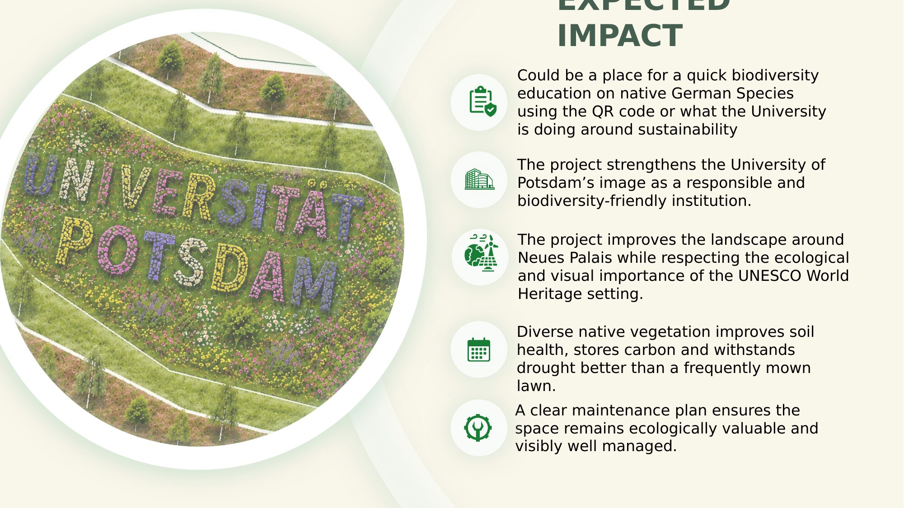
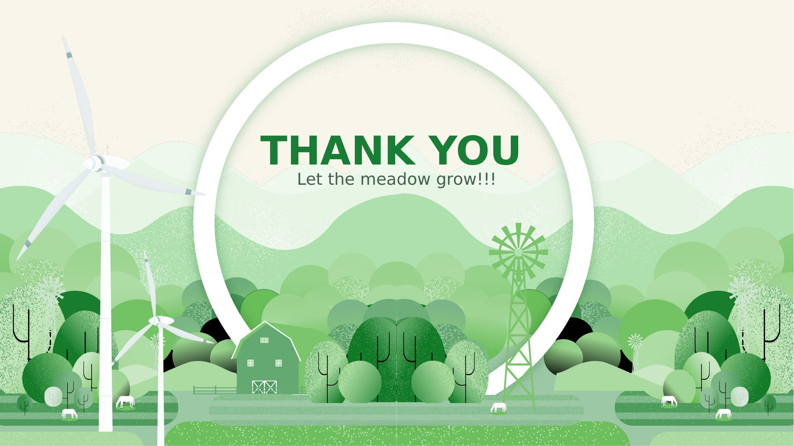

# 11 — Expected Impact

The awareness element could serve as a quick biodiversity education touchpoint on native German species — via a QR code — also communicating what the University is doing more broadly around sustainability.

The project strengthens the University of Potsdam's image as a responsible and biodiversity-friendly institution, while delivering a genuine, measurable ecological gain on a site that previously offered little habitat value.

---

*"Let the meadow grow!"* — Team Flower Power

